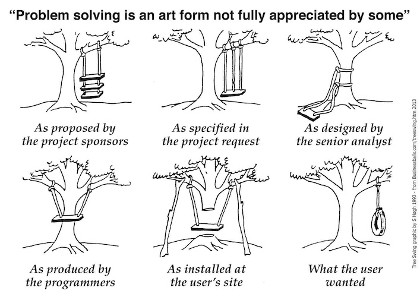

## BDD

```gherkin
Given [Scenario]
When [Action occurs]
Then [Result]
```

VV

## Why was BDD Developed?




VV

## BDD

```gherkin
Given I'm a customer
When I buy an item
Then ship it to me
```

VV

## BDD


VV

## BDD the good and bad

### Good:

* Allows business requirements to be specified in a way that is testable

### Bad:

* The amount of time and effort it takes to write the code to pass the test is onerous
