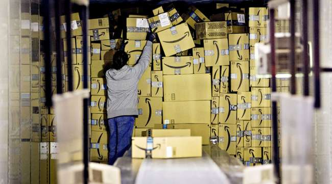
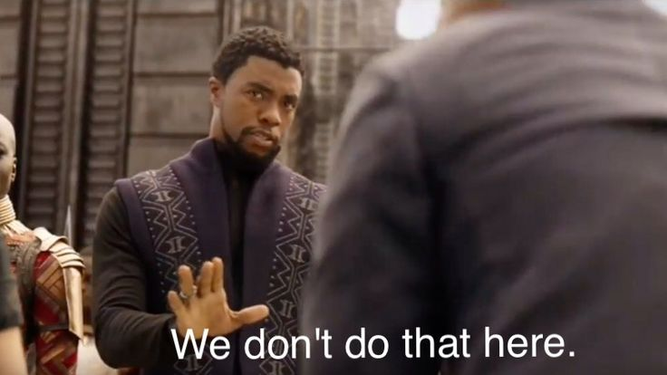
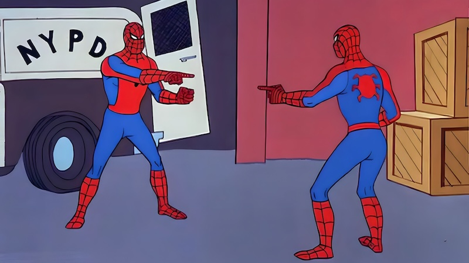
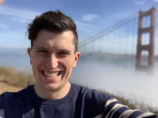
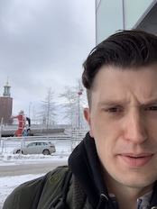
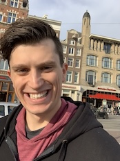

## My Story 

VV

 

Graduated High School in 2004

VV

 

Took a year off to work as a package handler

VV

 

Realized that manual labor wasn't for me

VV

Enrolled in DeVry in fall of 2005

VV 

Began an internship as a QA Tester at NAIC in spring of 2007

VV

 

Hired as a Software Engineer with NIPR in Winter 2008

Graduated in Fall of 2008 (don't recommend going to school and working full time)

VV
Early career was a bit of a struggle, gaps in my education/knowledge

VV

 

But found a good mentor who took me under his wing

VV

Started semi-regularly attending user groups in 2010/11

VV

Started looking for a new role in fall of 2014

VV

Had some painful realizations that I have pigeonholed myself

VV

Needed to get back to studying on basics and areas I have neglected

VV

Eventually landed another role at [Name redacted] in 
Spring of 2015

VV

It didn't go well

VV

Was able to get hired on as a Consultant with Keyhole Software in Fall of 2015

VV

Worked with several organizations in Kansas City including; YRC, American Century, and USDA

VV

 

Started presenting in Spring of 2016 at KCSUG (predecessor to KCJUG) 

VV

Covered a subject HATEOAS, underlying concept for REST and HTTP

VV

Chose this subject because it was related to an interview I absolutely bombed

VV

 

Started presenting on other subjects; Java 9 and JUnit 5 over 2017/18

VV

Started co-organizing with KCSUG in 2015 and then KCJUG in 2017

VV

 

Had the goal of getting in Developer Relations DevRel

VV

Eventually hired on at IBM in Fall 2018

VV

   

 

Did a lot of presenting and traveling in 2019

VV

Did a lot less in 2020

VV

Laid off from IBM in Winter 2021

VV

Hired by Oracle in Spring 2021

VV

Started Co-organizing KCDC in 2021
