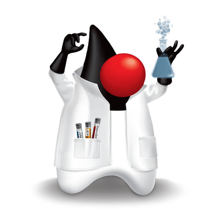

## Java is Data!

>>

## Java is Data!

Billy Korando 
 
Java Developer Advocate - Oracle ☕️🥑
 

>>

## Important Information

* Ask questions
* Reach out: 
    * Email: billy.korando@oracle.com ✉️
    * LinkedIn: https://www.linkedin.com/in/billy-korando-129b8197/ 
* Link to presentation: https://wkorando.github.io/presentations/java-dop/

>>

### Would you like to know more?

* https://dev.java
* https://inside.java
* https://youtube.com/java 
* Inside Java Podcast

>>

## JavaOne 2026 Announced!

    

March 17-19, 2026 
 
Redwood Shores, CA (Silicon Valley)
 
More info 👉 https://javaone.com

>>

## Agenda
* What is Data-Oriented Programming (DOP)?
* DOP Language Features
* Designing a DOP System
* When to Use DOP
* Practical Uses of DOP
* Future of DOP in Java