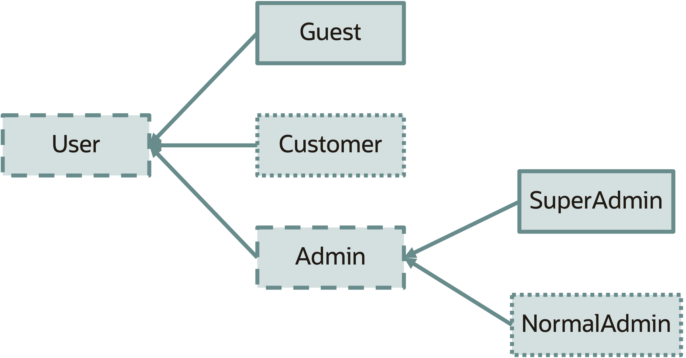

# Project Amber

vv

## Project Amber

Goal: Introduce smaller productivity-oriented Java language feates.

vv

## Key Language Changes

* Updates to `switch`
* Pattern matching for `instanceof`
* Records
* Sealed classes

vv
## Switch Updates

Added in Java 14 <br/>
JEP 361

vv

## Switch Updates

```java
switch(d){
	case 1:
		System.out.println("Sunday");
		break;
	case 2:
		System.out.println("Monday");
		break;
	case 3:
		System.out.println("Tuesday");
		break;
	case 4:
		System.out.println("Wednesday");
		break;
	case 5: 
		System.out.println("Thursday");
		break;
	case 6: 
		System.out.println("Friday");
		break;
	case 7: 
		System.out.println("Saturday");
		break;
}
```
vv
## Switch Updates
```java
switch(d){
	case 1 -> System.out.println("Sunday");
	case 2 -> System.out.println("Monday");
	case 3 -> System.out.println("Tuesday");
	case 4 -> System.out.println("Wednesday");
	case 5 -> System.out.println("Thursday");
    case 6 -> System.out.println("Friday");
	case 7 -> System.out.println("Saturday");
}
```

vv
## Switch Updates

```java
String day = switch(d){
	case 1 -> "Sunday";
	case 2 -> "Monday";
	case 3 -> "Tuesday";
	case 4 -> "Wednesday";
	case 5 -> "Thursday";
    case 6 -> "Friday";
	case 7 -> "Saturday";
	default -> throw new IllegalArgumentException();
}
```

vv

## Pattern Matching for instanceof

Added in Java 16 <br/>
JEP 394


vv
## Pattern Matching for instanceof

```java
Number someNumberType = ...

if(someNumberType instanceof Integer) {
	Integer i = (Integer) someNumberType;
	//do work
} else if (someNumberType instanceof Long) {
	Long l = (Long) someNumberType;
	//do work
} else if (someNumberType instanceof Double) {
	Double d = (Double) someNumberType;
	//do work
}
```
vv

## Pattern Matching for Instanceof

```java
Number someNumberType = ...

if(someNumberType instanceof Integer i) {
	//do work with i
} else if (someNumberType instanceof Long l) {
	//do work with l
} else if (someNumberType instanceof Double d) {
	//do work with d
}
```

vv

## Pattern Matching for Instanceof

```java
Number someNumberType = ...

if(someNumberType instanceof Integer i && i > 100) {
	//large number
} else if (someNumberType instanceof Integer i && i >= 0) {
	//small number
} else if (someNumberType instanceof Integer i && i < 0) {
	//negative number
}
```
vv

## Records
Added in Java 16 <br/>
JEP 395
vv

### Records

```java
String firstName1 = "Billy";
String lastName1 = "Korando";
String title1 = "Java Developer Advocate";
String twitterHandle1 = "@BillyKorando";

String firstName2 = "Sharat";
String lastName2 = "Chander";
String title2 = "Java Developer Advocate";
String twitterHandle2 = "@Sharat_Chander";

class Person{
	private String firstName;
	private String lastName;
	private String title;
	private String twitterHandle;
	public Person(String firstName, String lastName, String title, String twitterHandle) {
		this.firstName = firstName;
		this.lastName = lastName;
		this.title = title;
		this.twitterHandle = twitterHandle;
	}
	@Override
	public int hashCode() {
		final int prime = 31;
		int result = 1;
		result = prime * result + ((firstName == null) ? 0 : firstName.hashCode());
		result = prime * result + ((lastName == null) ? 0 : lastName.hashCode());
		result = prime * result + ((title == null) ? 0 : title.hashCode());
		result = prime * result + ((twitterHandle == null) ? 0 : twitterHandle.hashCode());
		return result;
	}
	@Override
	public boolean equals(Object obj) {
		if (this == obj)
			return true;
		if (obj == null)
			return false;
		if (getClass() != obj.getClass())
			return false;
		Person other = (Person) obj;
		if (firstName == null) {
			if (other.firstName != null)
				return false;
		} else if (!firstName.equals(other.firstName))
			return false;
		if (lastName == null) {
			if (other.lastName != null)
				return false;
		} else if (!lastName.equals(other.lastName))
			return false;
		if (title == null) {
			if (other.title != null)
				return false;
		} else if (!title.equals(other.title))
			return false;
		if (twitterHandle == null) {
			if (other.twitterHandle != null)
				return false;
		} else if (!twitterHandle.equals(other.twitterHandle))
			return false;
		return true;
	}
	@Override
	public String toString() {
		return "Person [firstName=" + firstName + ", lastName=" + lastName + ", title=" + title
				+ ", twitterHandle=" + twitterHandle + "]";
	}
}

var persons = Stream.of(new Person(firstName1, lastName1, title1, twitterHandle1), 
new Person(firstName2, lastName2, title2, twitterHandle2));

persons.forEach(System.out::println);
```
vv

## Records

```java
String firstName1 = "Billy";
String lastName1 = "Korando";
String title1 = "Java Developer Advocate";
String twitterHandle1 = "@BillyKorando";

String firstName2 = "Sharat";
String lastName2 = "Chander";
String title2 = "Java Developer Advocate";
String twitterHandle2 = "@Sharat_Chander";

record Person(String firstName, String lastName, String title, String twitterHandle) {}

var persons = Stream.of(new Person(firstName1, lastName1, title1, twitterHandle1),
		new Person(firstName2, lastName2, title2, twitterHandle2));

persons.forEach(System.out::println);
```

vv

## Records

* Transparent modeling of data as data
* `record Person(String firstName, String lastName, String title, String twitterHandle) {}`
* Superclass always `java.lang.Record`
* Cannot be extend, abstract, and implicitly final
* All fields are final (shallowly immutable)
* Cannot declare instance fields
* Accessors, hashcode, toString, equals, automatically generated
* Can override default implementation, or add your own method definitions 

vv

## Sealed Classes
Added in Java 17<br/>
JEP 409
vv

## Sealed Classes

vv

## Sealed Classes

```java
public abstract sealed class User 
permits Admin, Customer, Guest{

}
```

```java
public non-sealed class Customer extends User {

}
```

```java
public final class Guest extends User {

}
```

```java
public sealed class Admin 
extends User {
	public final class NormalAdmin extends Admin {
	}
	public final class SuperAdmin extends Admin {
	}
}
```

vv

## Themes

1. More expressive
	* Meaning can be more easily dervied from code
2. Safer
	* Compiler warnings
	* Address some security issues (serialization)
	* Fewer concerns with nulls
3. Reducing verbosity/ceremony
	* Not *just* about typing, but reducing opportunities for bugs

 
vv

## Data-Oriented Programming
**Object-Oriented Programming (OOP)** -> Classes model business behavior and entites
<br/>
**Data-Oriented Programming (DOP)** -> Classes model data

❗️OOP and DOP are not competing paradigms, DOP can be used alongside OOP as needed.

More here 👉 https://www.infoq.com/articles/data-oriented-programming-java/

vv

## Pattern Matching for Switch

Java 19<br/>
JEP 427 (Third Preview)
vv

### Pattern Matching for Switch

* Updates to `null` case behavior
* `when` clause replaces `&&` guard case

```java
static void testTriangle(Shape s) {
    switch (s) {
        case Triangle t
        when t.calculateArea() > 100 ->
            System.out.println("Large triangle");
        case Triangle t ->
            System.out.println("Small triangle");
        default ->
            System.out.println("Non-triangle");
    }
}
```
vv

## Record Patterns

Java 19<br/>
JEP 405 (first preview)

vv

### Record Patterns

```java
record Point(int x, int y) {}

void printSum(Object o) {
    if (o instanceof Point(var a, var b)) {
        System.out.println(a+b);
    }
}
```
vv


## Going Forward

* Withers
* String Templates
* Concise method bodies
* Even more pattern matching

vv

## Next steps

* [Project Amber OpenJDK](https://openjdk.org/projects/amber/)
* [Dev mailing list](https://mail.openjdk.org/mailman/listinfo/amber-dev)
* [State of Project Amber](https://www.youtube.com/watch?v=a8OdwUiSnXw)

