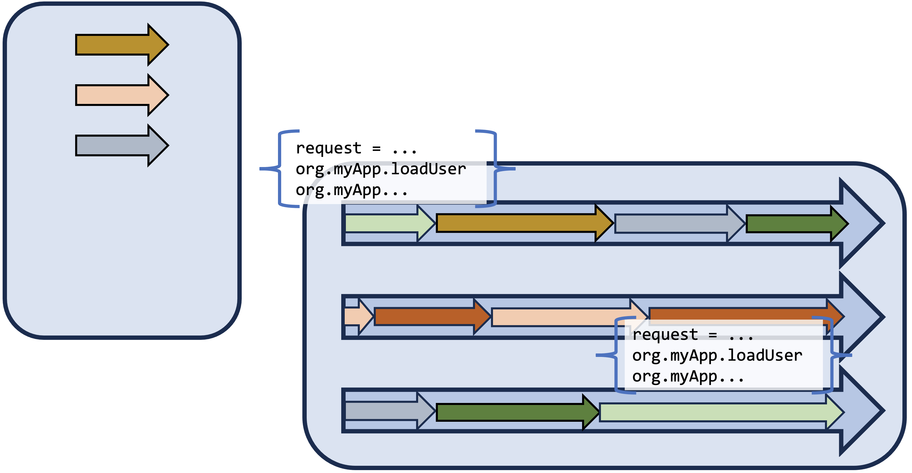

# Project Loom

vv
## Project Loom

JVM features and APIs for supporting easy-to-use, high-throughput, lightweight concurrency, and new programming models

vv

## Virtual Threads

Lightweight threads that are managed by the JVM provide horizontal scalability while maintaining a programming model that is familiar and easy to debug.

vv

## Virtual Threads

JDK 21  
JEP 444

vv

vv

## Structured Concurrency

Allows a unit of work to be split into multiple tasks that can be executed concurrently, but have them treated as a single unit of work to improve error handling, reliability, observability, and comprehensibility.

vv

## Structured Concurrency

JDK 23  
JEP 480 (Third Preview)

vv

## Scoped Values

Provide a lightweight and easily accessible means of storing immutable variables in a scope that is available to all threads in scope. 

This would be preferred to Thread-Local variables, especially when using a large number of virtual threads.

vv

## Scoped Values

JDK 23  
 
	JEP 481 (third preview)

vv

## Why Project Loom

Platform threads are heavyweight. Many applications, like web applications, have a thread-per-request model. Such applications are often thread-limited, while CPU and memory usage remains relatively light.  

Reactive programming attempts to address this, through a non-blocking programming style. However reactive programming is less intuitive and very difficult to debug and unit test. 

Project Loom aims to provide the horizontal scalability of reactive programming, while keeping a familiar blocking programming style, that is also easy to debug and unit test.  

vv

## More info on Loom

JEP Café - Virtual Threads:  
[https://www.youtube.com/watch?v=lKSSBvRDmTg](https://www.youtube.com/watch?v=lKSSBvRDmTg)
  
JEP Café - Launching 10 Million Concurrent Threads with Loom:   
[https://www.youtube.com/watch?v=UVoGE0GZZPI](https://www.youtube.com/watch?v=UVoGE0GZZPI)
  
JEP Café - Java Asynchronous Programming Full Tutorial with Loom and Structured Concurrency:   
[https://www.youtube.com/watch?v=2nOj8MKHvmw](https://www.youtube.com/watch?v=2nOj8MKHvmw)

vv

## Next steps

* [Project Loom OpenJDK](https://openjdk.org/projects/loom/)
* [Dev mailing list](https://mail.openjdk.org/mailman/listinfo/loom-dev)
* [State of Project Loom](https://www.youtube.com/watch?v=KG24inClY2M)
