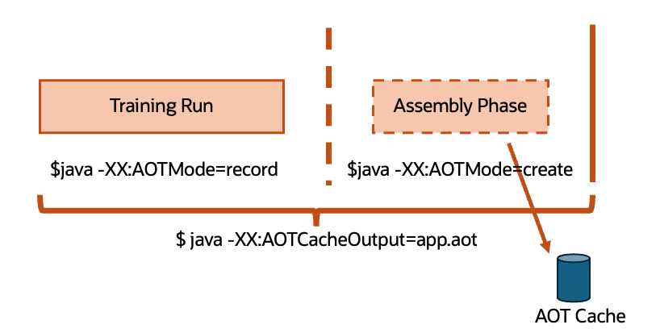
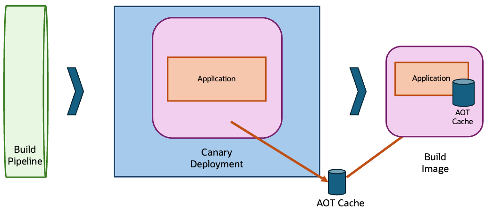

## What's in the Cache?! 

VV

##### JVM level:

* **Class loading, linking,** and initialization
	* **Reading classes from disk**
	* **Classfile validation and metadata construction**
	* Running static initializers
* Interpretation
* **Callsite linkage, constant pool resolution**
* **Profile gathering**
* JIT Optimizations

##### Application level: 

* Reading config files
* Scanning for annotations
* Opening sockets, registering listeners
* Creating loggers

VV

## Demo!

VV

## Advantages

✅ Preserves Java's dynamism 
 
✅ Platform independent
 
✅ Still have full JVM and JIT to fall back on

VV

## Java's Dynamism 

* Dynamic typing (array store checks, casting)
* Dynamic class loading and verification
* Dynamic class redefinition
* Dynamic compilation (JITting)
* Dynamic recompilation (deoptimization)
* Dynamic linkage and access control
* Dynamic dispatch (virtual methods)
* Dynamic introspection (instanceof, reflection)

VV

## Extra Work

⚙️ How to perform the training runs?  
⚙️ Where to store the cache?  

VV

## Building the Cache?

VV

## Where to Build the Cache?

VV

## Where to Build the Cache?

VV

## Where's the Cache?

VV

## Where's the Cache?

VV
	
## Demo part deux!

