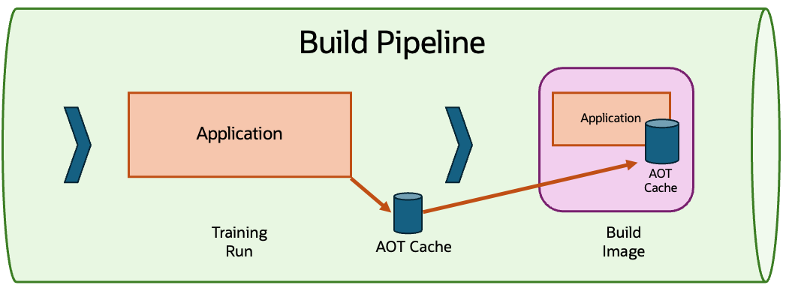

## What's in the Cache?! 

VV

## Start-up Phase

* Class data (pre-existing from CDS)
* Class loading and linking

VV

## Warm-up Phase

* Profiling code execution
* Object caching (in-progress)
* Code compilation (in-progress)

VV

## Demo!

VV

## Advantages

✅ Preserves Java's dynamism 
 
✅ Platform independent
 
✅ Still have full JVM and JIT and can fall back if cache is incorrect

VV

## Java's Dynamism 

* Dynamic typing (array store checks, casting)
* Dynamic class loading and verification
* Dynamic class redefinition
* Dynamic compilation (JITting)
* Dynamic recompilation (deoptimization)
* Dynamic linkage and access control
* Dynamic dispatch (virtual methods)
* Dynamic introspection (instanceof, reflection)

VV

## Extra Work

⚙️ Training Runs  
⚙️ Storing the cache  
&nbsp;&nbsp;&nbsp;🤔 Include in container image?  
&nbsp;&nbsp;&nbsp;🤔 Located in a shared volume?  

VV

## Where's the Cache?

VV

## Where's the Cache?

VV
	
## Demo part deux!

