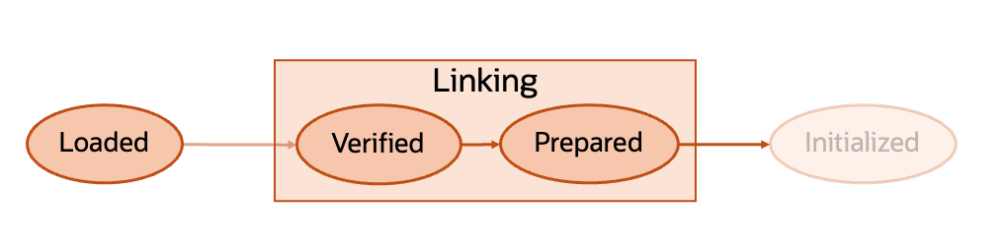

## Project Leyden

Named after a Leyden jar, which stored an electrical charge, and was the first capacitor. 

VV

## Project Leyden Goals 🥅

1. Reduce startup time - Time until first useful work
2. Reduce warmup time - Time until application reaches "peak" performance
3. Reduce footprint - Reduce the memory usage of an application* **

\* Not a current priority

\** Will come with the tradeoff of increased disk space

VV

## Timeshifting Work

Achieve goals of reduced startup time, warmup, and (eventually) footprint by "timeshifting" work from the runtime phase, to the build phase and storing it in an AOT Cache.

VV

## Building the Cache

VV

## Shipped Features 🚢

JEP 483: Ahead-of-Time Class Loading & Linking (JDK 24)

VV

## Upcoming Features 🎥

JEP 514: Ahead-of-Time Command-Line Ergonomics  (JDK 25)

JEP 515: Ahead-of-Time Method Profiling (JDK 25)