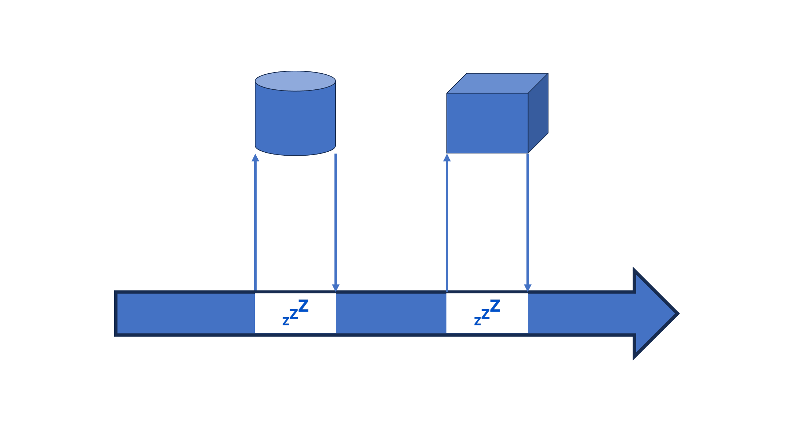
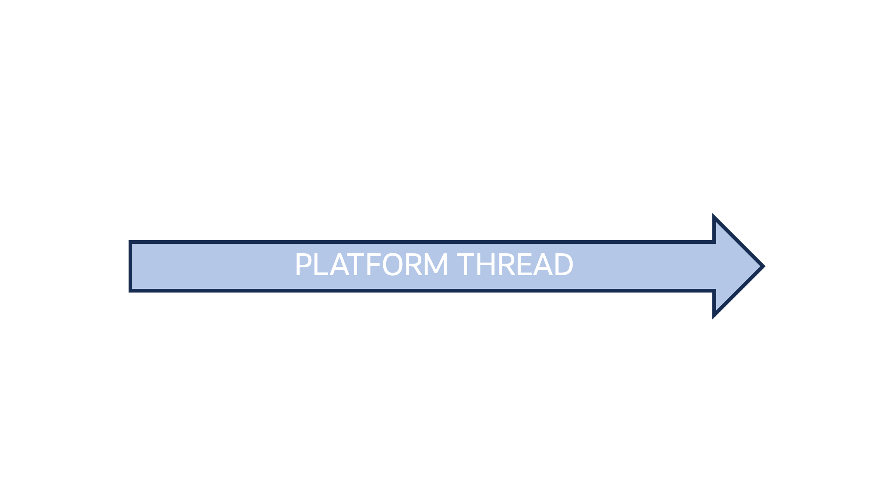
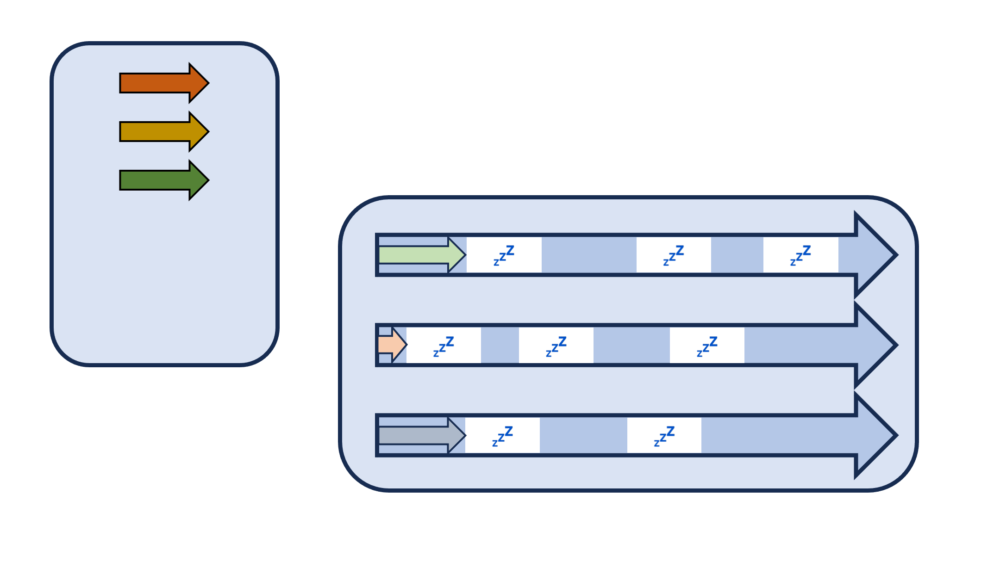
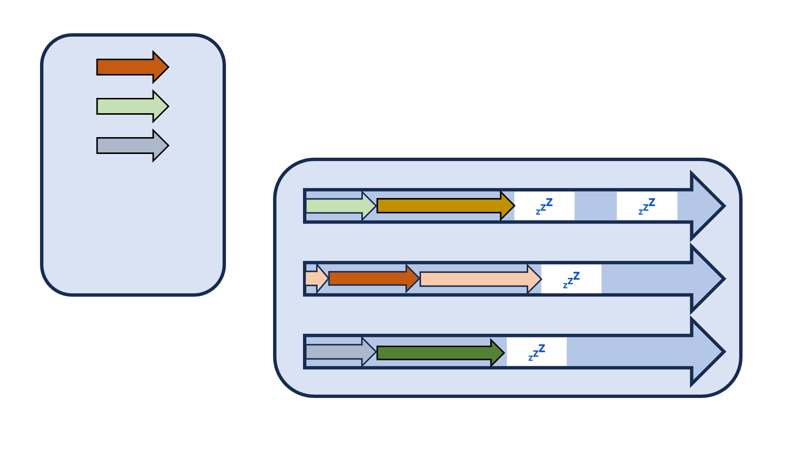
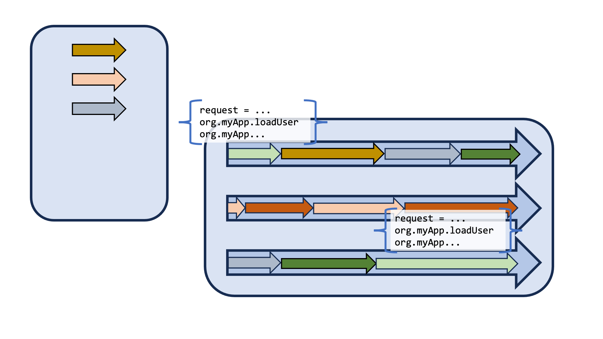

## Virtual Threads

JDK 21  
JEP 444
 
VV
### Virtual Threads

* First delivery from Project Loom
* Lightweight thread model that greatly increases the ability of writing, maintaining, and observing, a parallel/concurrent application.
* Eventually will be combined with Structured Concurrency (first preview, JDK 21, JEP 453) and Scoped Values (first preview, JDK 21, JEP 446)

VV

VV

VV

VV

VV

VV

VV

VV

VV

VV

VV
