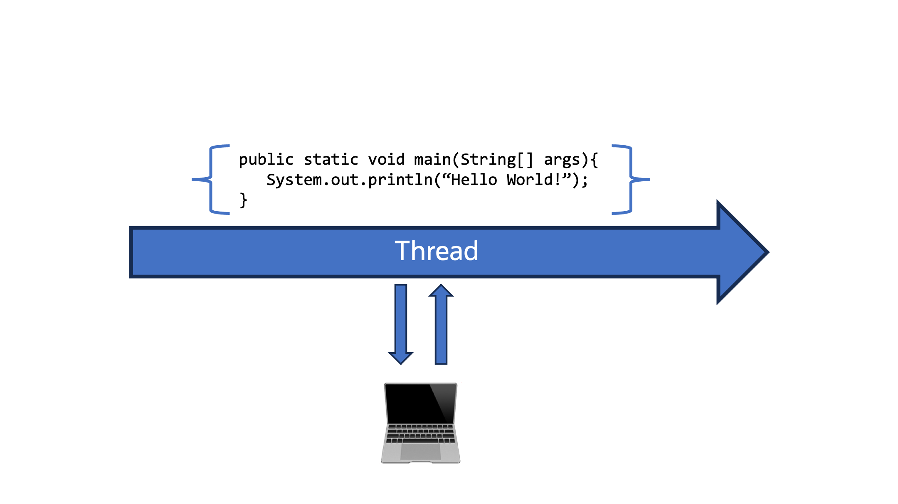
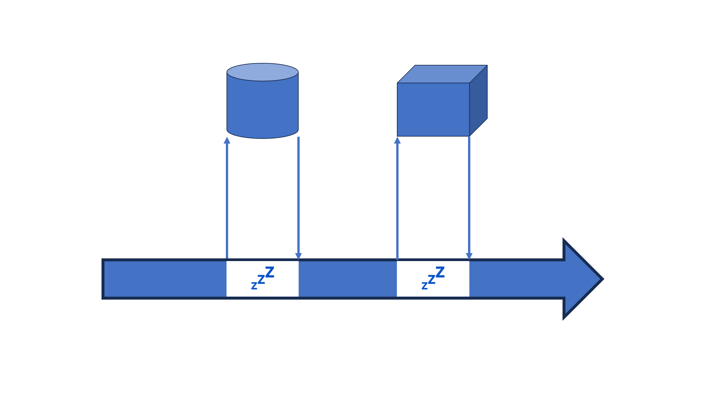
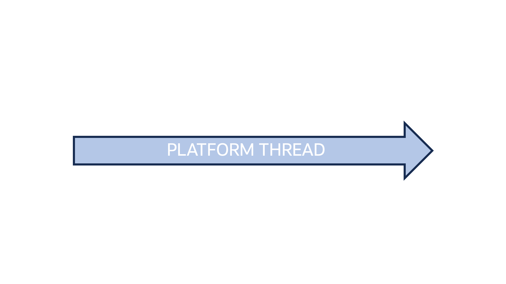
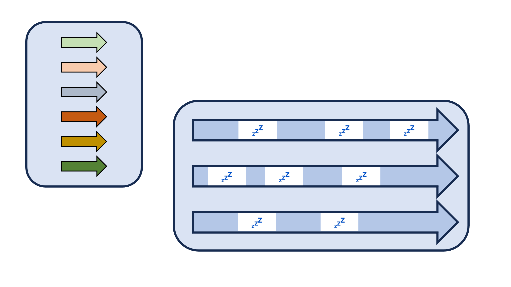
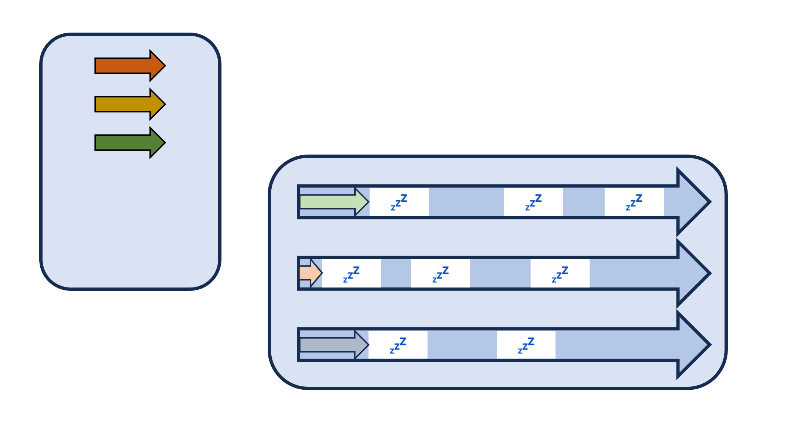
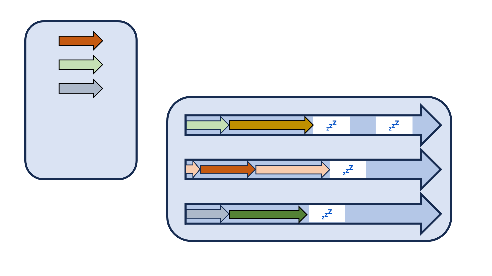
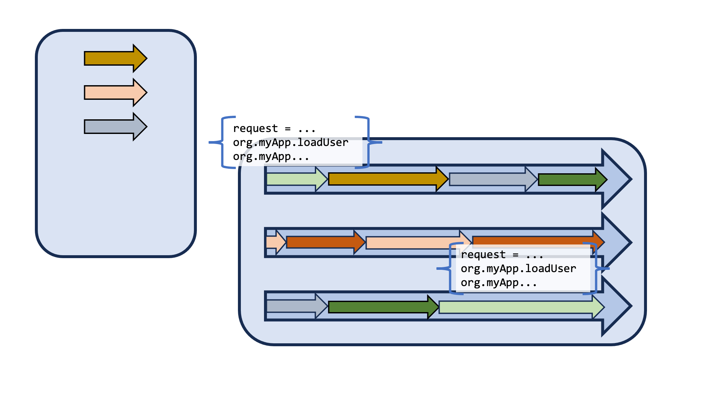

# API Updates

VV

## Sequenced Collections

JDK 21 <br/>
JEP 431
VV

### Sequenced Collections

```java
interface SequencedCollection<E> extends Collection<E> {
    // new method
    SequencedCollection<E> reversed();
    // methods promoted from Deque
    void addFirst(E);
    void addLast(E);
    E getFirst();
    E getLast();
    E removeFirst();
    E removeLast();
}

interface SequencedSet<E> extends Set<E>, SequencedCollection<E> {
    SequencedSet<E> reversed();    // covariant override
}
```

VV

### Sequenced Collections


```java
interface SequencedMap<K,V> extends Map<K,V> {
    // new methods
    SequencedMap<K,V> reversed();
    SequencedSet<K> sequencedKeySet();
    SequencedCollection<V> sequencedValues();
    SequencedSet<Entry<K,V> > sequencedEntrySet();
    V putFirst(K, V);
    V putLast(K, V);
    // methods promoted from NavigableMap
    Entry<K, V> firstEntry();
    Entry<K, V> lastEntry();
    Entry<K, V> pollFirstEntry();
    Entry<K, V> pollLastEntry();
}
```

VV

### Sequenced Collections


VV

## Virtual Threads

JDK 21 <br/>
JEP 444
 
VV

### Virtual Threads

* First delivery from Project Loom
* Lightweight thread model that greatly increases the ability of writing, maintaining, and observing, a parallel/concurrent application.
* Eventually will be combined with Structured Concurrency (first preview, JDK 21, JEP 453) and Scoped Values (first preview, JDK 21, JEP 446)

VV



VV


VV



VV


VV



VV


VV



VV



VV



VV



VV

### Foreign Function & Memory

JDK 22 <br/>
JEP 454

VV

## Jextract Tool

A tool for mechanically generating Java bindings from a native library's headers. 

More info 👉 [https://github.com/openjdk/jextract](https://github.com/openjdk/jextract)

VV

### Markdown in Javadoc

JDK 23 <br/>
JEP 467

VV

### Markdown in Javadoc

```java
/// - a module [java.base/]
/// - a package [java.util]
/// - a class [String]
/// - a field [String#CASE_INSENSITIVE_ORDER]
/// - a method [String#chars()]
```

VV

### Class-File API

JDK 24 <br/>
JEP 484
<br/>

<br/>
https://youtu.be/bQ2Rwpyj_Ks