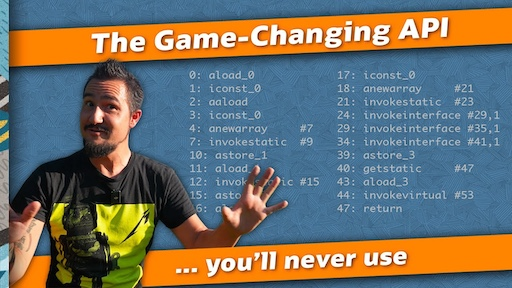

# Beyond

VV

### Structured Concurrency

JDK 22  <br/>
JEP 462 (second preview)

VV

### Scoped Values

JDK 22  <br/>
JEP 464 (second preview)

VV

### Vector API

JDK 22 <br/>
JEP 460 (seventh incubator) <br/>
<br/>
(Will remain in incubator until Valhalla starts delivering)


VV

### Class-File API

JDK 22 <br/>
JEP 457 (first preview)
<br/>

<br/>
https://youtu.be/bQ2Rwpyj_Ks

VV


### String Templates

JDK 21 <br/>
JEP 430 (first preview)

VV

### String Templates

```java
String title = "My Web Page";
String text  = "Hello, world";
String html = STR."""
        <html>
          <head>
            <title>\{title}</title>
          </head>
          <body>
            <p>\{text}</p>
          </body>
        </html>
        """;
```
VV
### String Templates

```
| """
| <html>
|   <head>
|     <title>My Web Page</title>
|   </head>
|   <body>
|     <p>Hello, world</p>
|   </body>
| </html>
| """
```
VV
### Implicitly Declared Classes and Instance Main Methods 

JDK 22 <br/>
JEP 463

VV

### Implicitly Declared Classes and Instance Main Methods

```java
public class HelloWorld {
	public static void main(String[] args) {
		System.out.println("Hello World!");
	}
}
```

VV


### Implicitly Declared Classes and Instance Main Methods

```java
class HelloWorld{
	void main(String[] args{
		System.out.println("Hello World!");
	}
}
```

VV

### Implicitly Declared Classes and Instance Main Methods

```java
void main() {
    System.out.println("Hello, World!");
}
```

VV

### Paving the On-ramp


Paving the On-ramp - [read more](https://openjdk.org/projects/amber/design-notes/on-ramp)
