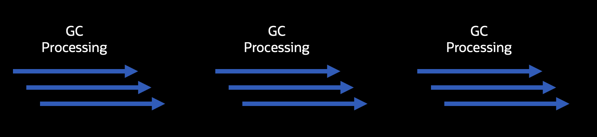

## What is a Garbage Collector?


VV

## Automatic Memory Collection

```java
public class NamePrinter{
  record Name(String fName, String lName){}
  public static void main(String[] args){
    Name aName = createName();
    printName(aName);
    ...//the rest of the program
  }
  private void printName(Name name){
    String formattedName = lName + ", " + fName;
    System.out.println(formattedName);
  }
  private Name createName(){
    return new Name("Billy", "Korando");
  }		
}
```

VV

## Terminology
VV
# Concurrent != Parallel 

VV

## Serial vs Parallel


VV

## Serial vs Parallel



VV

## Non-Concurrent vs Concurrent


VV

## Non-Concurrent vs Concurrent


VV

## Generational Garbage Collectors


VV
## Generational Garbage Collectors


VV
## Generational Garbage Collectors

**Weak Generational Hypothesis** - States that young objects tend to die young, while old objects tend to stick around
VV

## Garbage Collection Design Principles


VV
## Garbage Collection Design Principles

VV
## Garbage Collection Design Principles

VV

## Other GC Benefits

* Memory compaction
* Deduplicating data (JEP 192)
* Updating data representations (JEP 254)
