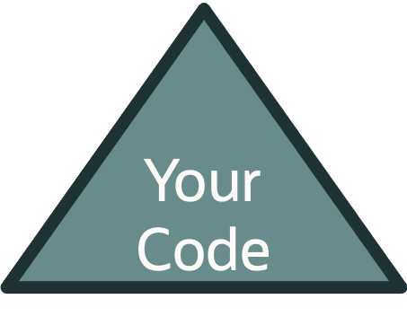
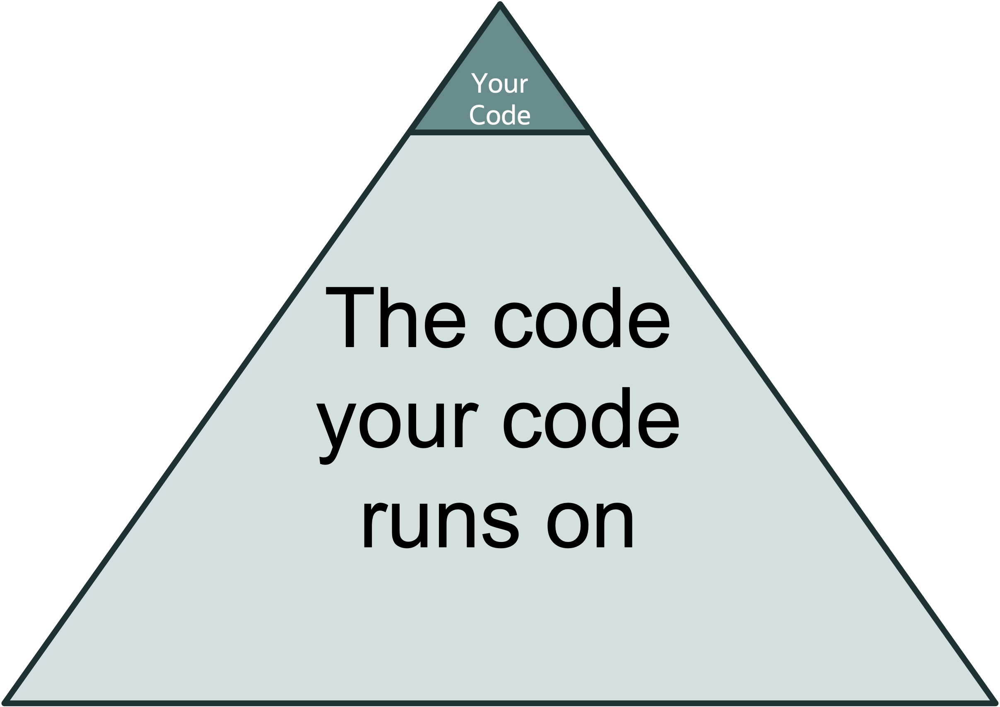

# Why Write Automated Tests?
vv
## Automated Testing Commitments
* Substantial time and effort to write tests
* Substantial time and effort to maintain tests
* Time spent writing and maintaining tests => time spent writng production code
vv
## Automated Deployment Process
🏠
 
🧱🧱🧱🧱🧱🧱 
🧱🧱🧱🧱🧱🧱🧱🧱 
🧱🧱🧱🧱🧱🧱🧱🧱 
vv
## The Dependency Iceberg

vv
## The Dependency Iceberg

vv
## Manual Test Costs
The high effort of regression testing, disincentivizes keeping dependencies up-to-date
vv
## Automated Deployment Process
vv
## Additional Benefits
* Auditable
    * Can review test code, reports, logging, etc.
* Repeatable
    * Can re-execute test to see if problem persists
    * Can run test against other versions to see if problem persists    
vv
## How Many Tests Should I Write?
Whatever gives you the confidence to deploy to production without manual intervention.
vv
## Manual Testing
Manual Texting still needed

But exploratory in nature
